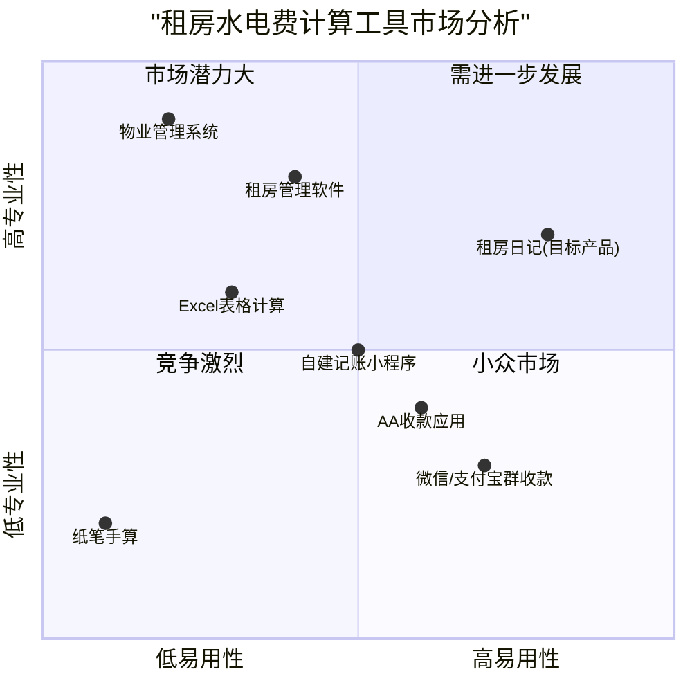

# 租房日记水电费计算系统 - 产品需求文档

## 项目概述

### 项目名称

rental_utilities_calculator

### 原始需求

水费计算功能：
1. 屋子内有至少2个以上的房间，每个房间有大于等于1人
2. 每个屋子内的人员是变动的，有可能0人，也可能2个或更多
3. 水费按照人头计算
4. 计算结束后要立即弹窗或新的页面弹出计算结果
5. 计算规则需要有一个弹窗输出计算规则明细
6. 保留计算历史，要有一个页面可以管理计算历史，点击历史要输出计算结果详情
7. 结果集要包含房间号，人员，居住时间，居住天数，分摊系数，应付水费等结果
8. 页面和展示结果需要美化和科技感、高级感

电费计算功能：
1. 计算规则是按照屋子计算，不按照人头
2. 按照给定的季度时间计算，季度内每屋是否有人需要选择不同的时间段
3. 电费的计算规则默认是按照均摊的
4. 计算历史页面需要区分水费和电费，提供筛选功能

其他注意事项：
1. © 2025 租房日记 要永远在页面最底部
2. 页面标题为：租房日记
3. 各种弹窗需要进行个性化优化
4. 所有交互内容必须使用中文

## 产品定义

### 产品目标

1. 提供准确、公平的水电费分摊计算工具，解决合租人群水电费分配问题
2. 简化租房生活中繁琐的水电费计算过程，减少室友之间因费用引起的纠纷
3. 通过清晰的计算历史记录，增强租客之间的信任与透明度

### 用户故事

1. 作为一名大学生租客，我希望能够根据实际居住时间和人数公平分配水费，以便每个人只需支付自己应承担的部分
2. 作为一名房间管理员，我希望有一个直观的工具计算每个房间的电费分摊，以便快速结算并告知所有租客
3. 作为一名经常出差的租客，我希望系统能够根据我不在家的时间段调整费用计算，以便我只需支付实际使用期间的费用
4. 作为一名长期租客，我希望能够查看历史账单和计算详情，以便了解费用变化趋势和进行财务规划
5. 作为合租公寓的负责人，我希望有一个专业的计算工具，以便向所有租客清晰地展示费用分配的公平性和准确性

### 竞品分析

#### 1. 微信/支付宝群收款
- 优点：使用普遍，操作简单，直接关联支付功能
- 缺点：无法自动计算分摊金额，没有考虑居住时间差异，无历史记录管理

#### 2. Excel表格计算
- 优点：可自定义公式，灵活性强，可保存历史数据
- 缺点：需要手动操作，用户体验差，分享不便，容易出错

#### 3. AA收款应用
- 优点：专注于费用分摊，操作简单，有基本的分账功能
- 缺点：不针对租房场景，无法处理复杂的时间段计算，界面简陋

#### 4. 租房管理软件
- 优点：功能全面，包含租约管理、账单管理等
- 缺点：体系庞大复杂，上手难度高，不专注于水电费计算，价格较高

#### 5. 自建记账小程序
- 优点：可定制化程度高，界面简洁
- 缺点：功能有限，缺乏专业的计算模型，数据存储不稳定

#### 6. 物业管理系统
- 优点：专业性强，数据准确，集成多种功能
- 缺点：面向企业用户，个人难以获取，价格昂贵，操作复杂

#### 7. 纸笔手算
- 优点：无需依赖设备，随时可用
- 缺点：计算繁琐，容易出错，无法保存历史，效率低下

### 竞品象限图



## 技术规格

### 需求分析

本系统旨在提供一个专业的租房水电费计算工具，满足多房间合租场景下的公平费用分摊需求。系统将针对水费和电费采用不同的计算规则：水费按照人头和实际居住时间计算，电费按照房间和实际入住时间计算。系统需要提供直观的用户界面，完善的计算规则说明，以及详细的历史记录管理功能。整体设计需要具备科技感和专业感，同时确保操作简单易用。

### 需求池

#### P0（必须实现）

1. 水费计算功能
   - 支持设置多个房间（至少2个）和每个房间的住户信息
   - 支持每个房间住户数量的动态调整（0人或多人）
   - 根据实际居住人数和时间计算水费分摊
   - 计算结果包含：房间号、人员、居住时间、居住天数、分摊系数、应付水费
   - 计算完成后立即展示详细结果

2. 电费计算功能
   - 按房间计算电费分摊
   - 支持设置季度时间范围和每个房间的实际入住时间段
   - 按照房间入住时间占比均摊电费
   - 电费计算结果清晰展示

3. 历史记录管理
   - 保存所有计算历史
   - 区分水费和电费记录
   - 支持查看历史计算的详细结果
   - 提供筛选功能（按水费/电费类型筛选）

4. 用户界面基础要求
   - 所有内容使用中文显示
   - 页面底部显示版权信息：© 2025 租房日记
   - 页面标题统一为：租房日记

#### P1（应该实现）

1. 计算规则说明
   - 水费计算规则弹窗说明
   - 电费计算规则弹窗说明
   - 规则说明图文并茂，易于理解

2. 用户界面增强
   - 美化所有弹窗设计，增加个性化元素
   - 结果展示页面具有科技感和高级感
   - 响应式设计，适配不同设备

3. 数据验证与提示
   - 输入数据验证，防止无效输入
   - 友好的错误提示和引导

#### P2（可以实现）

1. 高级功能
   - 支持自定义计算规则
   - 数据导出功能（Excel、PDF等格式）
   - 多主题切换
   - 黑暗模式支持

2. 数据分析
   - 费用趋势图表
   - 历史费用对比分析
   - 人均消耗统计

3. 系统集成
   - 账单分享功能
   - 支付提醒
   - 与常用支付平台集成

### UI设计草图

#### 主页布局

```
+------------------------------------------+
|              租房日记                    |
+------------------------------------------+
|                                          |
|  +-------------+    +---------------+    |
|  |   水费计算  |    |   电费计算    |    |
|  +-------------+    +---------------+    |
|                                          |
|  +----------------------------------+    |
|  |         计算历史记录             |    |
|  +----------------------------------+    |
|                                          |
+------------------------------------------+
|          © 2025 租房日记                 |
+------------------------------------------+
```

#### 水费计算页面

```
+------------------------------------------+
|              租房日记 - 水费计算         |
+------------------------------------------+
| 季度时间范围：[开始日期] 至 [结束日期]   |
| 季度总水费：[输入框] 元                  |
|                                          |
| + 添加房间                               |
|                                          |
| 房间1:                                   |
| + 添加住户                               |
|   - 住户1: [姓名] [入住日期] [退房日期]  |
|   - 住户2: [姓名] [入住日期] [退房日期]  |
|                                          |
| 房间2:                                   |
| + 添加住户                               |
|   - 住户1: [姓名] [入住日期] [退房日期]  |
|                                          |
| [计算水费] [查看计算规则]                |
+------------------------------------------+
|          © 2025 租房日记                 |
+------------------------------------------+
```

#### 水费计算结果弹窗

```
+------------------------------------------+
|              水费计算结果                |
+------------------------------------------+
| 季度: 2025年1月1日 至 2025年3月31日     |
| 总水费: 380元                           |
|                                          |
| +------+------+--------+-----+------+----+
| |房间号|住户  |居住时间|天数 |系数  |应付|
| +------+------+--------+-----+------+----+
| |房间1 |张三  |1/1-3/31|90天 |0.25  |95元|
| |房间2 |李四  |1/1-1/31|31天 |0.09  |34元|
| |      |王五  |1/1-3/31|90天 |0.25  |95元|
| |房间3 |赵六  |1/1-2/15|45天 |0.125 |48元|
| |      |钱七  |3/15-3/31|16天|0.045 |17元|
| |房间4 |孙八  |1/1-3/31|90天 |0.25  |95元|
| +------+------+--------+-----+------+----+
|                                          |
| [打印] [保存] [关闭]                    |
+------------------------------------------+
```

#### 电费计算页面

```
+------------------------------------------+
|              租房日记 - 电费计算         |
+------------------------------------------+
| 季度时间范围：[开始日期] 至 [结束日期]   |
| 季度总电费：[输入框] 元                  |
|                                          |
| + 添加房间                               |
|                                          |
| 房间1:                                   |
| 入住时间: [开始日期] 至 [结束日期]       |
|                                          |
| 房间2:                                   |
| 入住时间: [开始日期] 至 [结束日期]       |
|                                          |
| 房间3:                                   |
| 入住时间: [开始日期] 至 [结束日期]       |
|                                          |
| [计算电费] [查看计算规则]                |
+------------------------------------------+
|          © 2025 租房日记                 |
+------------------------------------------+
```

#### 历史记录页面

```
+------------------------------------------+
|              租房日记 - 计算历史         |
+------------------------------------------+
| 筛选: [全部] [水费] [电费]               |
|                                          |
| +------+--------+-------+--------+-------+
| |类型  |计算日期|季度   |总金额  |操作   |
| +------+--------+-------+--------+-------+
| |水费  |2025/4/1|Q1 2025|380元   |查看   |
| |电费  |2025/4/1|Q1 2025|450元   |查看   |
| |水费  |2025/1/2|Q4 2024|320元   |查看   |
| |电费  |2025/1/2|Q4 2024|410元   |查看   |
| +------+--------+-------+--------+-------+
|                                          |
| [1] [2] [3] [4] [5] [>]                 |
+------------------------------------------+
|          © 2025 租房日记                 |
+------------------------------------------+
```

### 开放问题

1. 水费计算中，如何处理房间在某段时间无人居住的情况？是否需要对这段时间的水费进行特殊处理？

2. 对于季度中途搬入或搬出的住户，是否需要考虑更精确的时间计算（如按小时计算而非按天）？

3. 电费计算中，是否需要考虑不同房间的用电量差异（如某些房间有高耗能电器）？

4. 系统是否需要支持多套房屋的管理，以满足管理多个合租地点的需求？

5. 计算历史记录保存多久？是否需要提供数据备份和恢复功能？

6. 是否需要提供用户账号系统，以支持多设备同步和数据安全？

## 附录

### 计算规则详解

#### 水费计算规则

1. 总人天数计算：
   - 每个住户的人天数 = 该住户的实际居住天数
   - 总人天数 = 所有住户的人天数之和

2. 每个住户的分摊系数：
   - 住户分摊系数 = 该住户的人天数 ÷ 总人天数

3. 每个住户应付水费：
   - 应付水费 = 季度总水费 × 住户分摊系数

#### 电费计算规则

1. 总房间天数计算：
   - 每个房间的天数 = 该房间在季度内有人居住的天数
   - 总房间天数 = 所有房间的天数之和

2. 每个房间的分摊系数：
   - 房间分摊系数 = 该房间的天数 ÷ 总房间天数

3. 每个房间应付电费：
   - 应付电费 = 季度总电费 × 房间分摊系数
